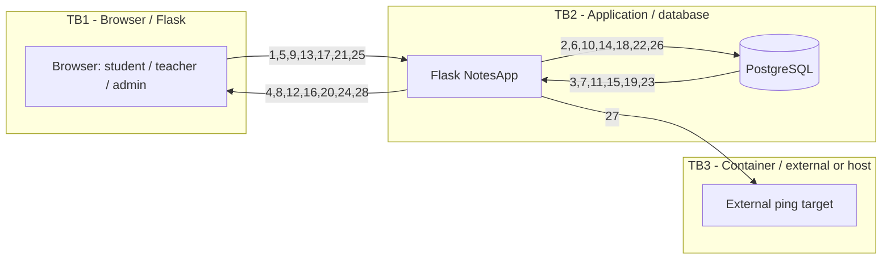

# NotesApp data-flow diagram

```mermaid
flowchart LR
  B[Browser: student / teacher / admin]
  F[Flask NotesApp]
  D[(PostgreSQL)]
  E[External ping target]

  B -->|1,5,9,13,17,21,25| F
  F -->|4,8,12,16,20,24,28| B
  F -->|2,6,10,14,18,22,26| D
  D -->|3,7,11,15,19,23| F
  F -->|27| E

  subgraph TB1[TB1 - Browser / Flask]
    B
  end
  subgraph TB2[TB2 - Application / database]
    F
    D
  end
  subgraph TB3[TB3 - Container / external or host]
    E
  end
```
